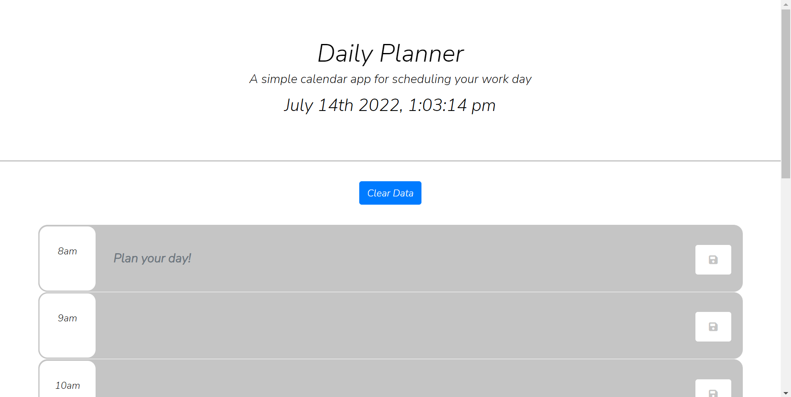

# Daily-Planner

This project was completed for KU's coding boot camp assignment 5. 

The goal of this project was to create a responsive, color coded daily planner.

## Check out the Project
Check out the different aspects of the project below:

- [GitHub Page](https://johnathanmann.github.io/Daily-Planner/)
- [Repository](https://github.com/johnathanmann/Daily-Planner)
- [Video of deployed application](https://drive.google.com/file/d/1ii_v0yNJdjf6-GYZvWohaS0N2v_hcylY/view)

## Install
Feel free to install using GitHubs recommended clone methods or by downloading the code and opening it in your preferred text editor.

## Requirements
To use the project all you need is a browser, but to access the code you need your text editor of choice.

## Summary
This site helps you plan out your day and keep track of events that will happen or have happened. This site works by checking the current hour using moment.js and comparing it to the hours on the planner to decide weather or not times of the dau have happened. The text inputs are only saved to local storage if the save button is clicked. The save button is curtesy of Font Awesome. The clear data button works by clearing localStorage and refreshing the page. During the creation of this project an emphasis was put on implementing JQuery when it seemed fit.
